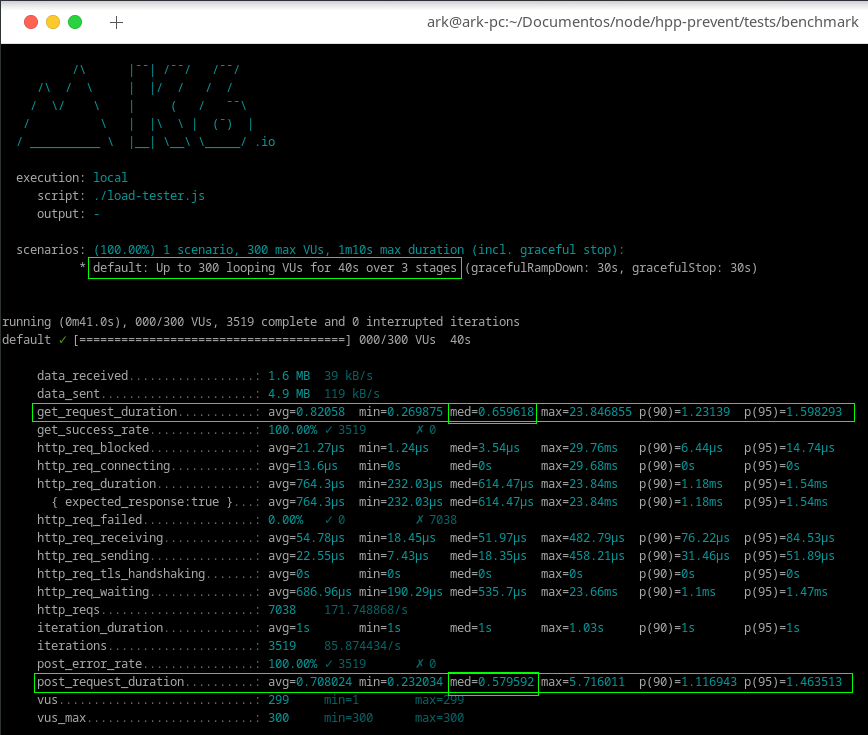

## HPP-PREVENT


[](https://codecov.io/gh/R9n/hpp-prevent)
[](https://shields.io/)
[](https://shields.io/)

### Express middleware for prevent **_http parameter pollution_**

hpp-prevent is a middleware for express to prevent hpp (http param pollution) attack

#### What is, and how works, a hpp attack ?

hpp is a type of attack where an external attacker adds parameters with the same name to a given endpoint. This, depending on the platform used, can generate unexpected behavior of the systems. Is the case of **_Express_**, more than one parameter with the same name will be added in an array.
Or worse, this can override some valid parameters.

#### hpp-atack example

**_endpoint:_** `https://your-api.com/name=value1&lastname=value2`
The atacker can add more parameters with the same name to the enpoint url, this way.

**_endpoint:_** `https://your-api.com/name=value1&lastname=value2&name=value3&lastname=value4`

And then, in your backend you will get this output when you access the **_request.query_** object

```
{
name: ['value1','value3'],
lastname: ['value2','value4']
}
```

When this was the object you expected

```
{
name: 'value1',
lastname: 'value2'
}
```

This attack is normally used as a gateway to more sophisticated attacks, however, its destructive capacity should not be underestimated.

#### And how **_hpp-prevent_** solve this problem ?

**_hpp-prevent_** lets you configure the behavior of Express, you can choose to take the last or the first occurrence of some parameter when some parameter is passed more than one time. This is important because, sometimes you have to match the order of Express and other firewall systems, if this order of validation mismatch, your validation will be bypassed.

Using this middleware, this polluted **_endpoint:_** `https://your-api.com/name=value1&lastname=value2&name=value3&lastname=value4` will result in a safe **_request.query_** object, like this.

```
{
name: 'value1',
lastname: 'value2'
}
```

[`***Click here for a more detailed explanation about http parameter pollution (By Owasp)***`](https://owasp.org/www-project-web-security-testing-guide/latest/4-Web_Application_Security_Testing/07-Input_Validation_Testing/04-Testing_for_HTTP_Parameter_Pollution)

#### How to use

To use hpp-prevent is pretty easy.

#### First import the library

`const hppPrevent = require('hpp-prevent')`

#### Second, configure the library.

To do so, you need to call the **_config_** method, that function accept these parameters:

-   **_takeLastOcurrences_**: Boolean that indicates what is the element that will be picked when more than one parameter with the same name is found, true indicates that the last element will be picked, false indicates that the first element will be picked. For default is **_true_**

-   **_blacklist_**: This is a list of terms that you want to explicitly block in your query parameters, once a term is put in this list, the parameter and value will be stripped off from parameters if a key or a value match the term in the blacklist. By default, this list comes filled with **\_**proto**\_** and **_constructor_** words that are usually used to perform prototype pollution attacks.

-   **_whitelist_**: May want to have some parameter having multiple values, in this case you can put the parameters that you expect to have more than one value in this list. By default, is an empty list
-   **_returnBadRequestReponse_**: This variable controls if a bad request response should be returned if any of the parameters of the query object match to a term in the blacklist. If this variable is set to **_true_** and any term is found in blacklist then a bad Request response with status 400 will be returned, otherwise, if any of the parameters is found in black list and this variable is **_false_** then that parameter will be stripped off from the query object and no response will be returned, the processes of the request will continue as normal. By default, is set to **_false_**

-   **_customInvalidParamMessage_**: This is a string that will be returned in case of
    **_returnBadRequestReponse_** variable is set to true and any of the terms in query object is found in blacklist

-   **canIgnoreBodyParse**: This controls if you want or not to parse the top level body properties in search of prototypes patterns

-   **deepSearch**: This controls if you want to perform a deep search in request body and query objects, this perform a full scanning of query and body objects.
    but **TAKE CARE**. If the payload received is too large this can lead to a system degradation. I sugest to limit the maximum payload size of the request ( this is another best practice security). This way you will be safe to parse the full body of the request.

```
const hppPrevent = require('hpp-prevent');

hppPrevent.config({
  takeLastOcurrences: false,//this tell to take the first occurrence of any duplicated param
  blackList: ['select'],
  returnBadRequestReponse: true,
  customInvalidParamMessage: 'Invalid param, please remove it',
})
```

#### Third, set the express app to use the middleware

`app.use(hppPrevent.hppPrevent)`

#### How to use as a endpoint level middleware

If you don't want to apply the middleware to all your endpoints, you can use it only on certain endpoints, this way

```
app.get('/your-endpoint',httpPrevent.hppPrevent,(request,response)=>{
  /// This way the middleware will be applied only on this endpoint
})
```

#### How to use the exposed **parseParams** method

In case you want to do the validation only in specific cases inside your endpoint, you can use the **parseParams** method to validate only the data you want and in the situation you want. This method will additionally remove any and all top-level properties from the request.body object that contain any reference to the javascript **prototype** object access terms to help prevent another type of attack, the [**Prototype Pollution Attack**](https://learn.snyk.io/lessons/prototype-pollution/javascript/).

**parseRequestBody** receives theses arguments:
**bodyParams** : Object with request body , the request.body object
**returns**: Return a dto like

```
{
    sanitizedParams, // body parameters sanitized
    forbiddenParametersFound  // forbidden properties found in body object and removed from teh sanitized parameters
}
```

**parseParams** method receives theses arguments:

**objectParams**: Object with query parameters, the request.query object

**isLastParams** : Boolean value to set the parameter's order, if false, take the first

occurance, otherwise take the last occurance

**forbiddenTerms**: List with the terms that you want to explicity block from query parameters

**expectedParamsToBeArray**: List with the params that you expect to be array in the query parameters

**returns**: Return a dto like

```
{
    sanitizedParams, // sanitized parameters
     forbiddenParametersFound  // forbidden properties found in object and removed from the sanitized parameters
}
```

#### How to use the exposed **getCurrentConfig** and **resetConfig** methods

If you, for some reason, need to retrive the current lib configuration you can do this calling the **getCurrentConfig** method. This method will return to you a dto like this

```
{

      isLastParams: true,
      forbiddenTerms: [ '__proto__', 'constructor' ],
      expectedParamsToBeArray: [],
      isToReturn400Reponse: false,
      invalidParamMessage: undefined,
      ignoreBodyParse: true

}

```

And, if you want to reset lib configuration to the original state, to aply different behavior to another endpoint for example, you can do this calling teh method **resetConfig** method, this way:

```
hppPrevent.resetConfig()
```

# **🔴VERY IMPORTANT!!!!!🔴**

You **must** parse the request query and body before apply this middleware.
To do so, you can use the default express json parser, **Express.json()** and **express.urlencoded({ extended: true})**. This way:

```
... rest of your code

app.use(Express.json()); //This has to be called before middleware
app.use(express.urlencoded({ extended: true}))  // this also come before the middleware
app.use(hppPrevent.hppPrevent);

... rest of your code
```

#### Performance

To test the performance of the middleware I created a small api and ran a simple load test on top of two situations, a **POST** with body + query-parameters and a **GET** with query parameters.
The result was very good. For a 300 concurrent request, this was te result



As you can see, with deepSearch enabled, the request time is between 0.5 and 0.6 ms, that is very good for the first version of package :D

That 's all !!

Hope this package help you to make your api more secure 😀😀

#### License


#### About the author

Dev, security enthusiast, Gamer :D

**_LinkedIn_**: www.linkedin.com/in/ronaldo-mp

**_Github_**: https://github.com/R9n
